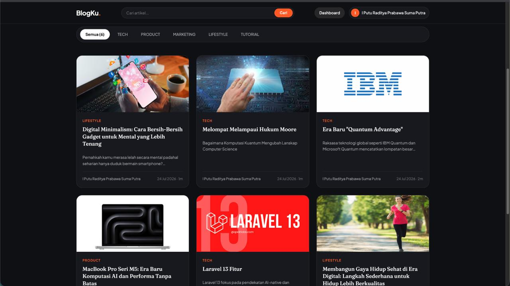

# Jadi CMS


Blog CMS berbasis Laravel — dibuat untuk tim editorial kecil maupun penulis mandiri yang membutuhkan antarmuka pengelolaan konten yang bersih, aman, dan cepat.

## Fitur Utama

- **Blog publik** dengan tampilan modern bergaya Veloflex (dark theme, trending section, category pills)
- **CMS Admin** dengan tabel post, kategori, dan tag
- **Multi-role**: Admin, Editor, Author, Reader — masing-masing dengan batasan akses yang tepat
- **REST API** untuk post, kategori, dan tag (autentikasi via Laravel Sanctum)
- **RSS Feed** terbuka di `/feed` — kompatibel dengan semua RSS reader
- **Sitemap XML** otomatis di `/sitemap.xml`
- **Upload gambar** featured post dengan validasi tipe dan ukuran
- **SEO-ready**: meta title, meta description, canonical, Open Graph, Twitter Card per artikel
- **Keamanan**: restrict delete pada kategori/user agar post tidak terhapus secara cascade, draft hanya terlihat oleh pemiliknya (Author)
- **Markdown** untuk body artikel dengan syntax highlighting via highlight.js

## Tech Stack

| Layer | Teknologi |
|---|---|
| Framework | Laravel 13 (PHP 8.3+) |
| Database | SQLite (dev) / MySQL atau PostgreSQL (production) |
| Auth | Laravel Breeze + Sanctum |
| Frontend | Blade + Vanilla CSS |
| Markdown | league/commonmark |
| Testing | Pest PHP |

## Persyaratan Sistem

- PHP 8.3+
- Composer
- Node.js & npm
- SQLite (default) atau MySQL/PostgreSQL

## Instalasi

```bash
# 1. Clone repositori
git clone https://github.com/dittprabawa/blogku.git
cd blogku

# 2. Setup otomatis (install, .env, key generate, migrate, build aset)
composer setup
```

Atau secara manual:

```bash
composer install
cp .env.example .env
php artisan key:generate
php artisan migrate
npm install && npm run build
```

## Konfigurasi

Salin `.env.example` ke `.env` dan sesuaikan nilai-nilai berikut:

```env
APP_NAME="Nama Blog Anda"
APP_URL=http://localhost

DB_CONNECTION=sqlite         # Ganti ke mysql/pgsql untuk production

# Admin user pertama (dipakai oleh seeder)
ADMIN_NAME="Admin"
ADMIN_EMAIL=admin@example.com
ADMIN_PASSWORD=rahasia123
```

## Seed Admin Pertama

```bash
php artisan db:seed --class=AdminUserSeeder
```

Seeder membaca `ADMIN_NAME`, `ADMIN_EMAIL`, `ADMIN_PASSWORD` dari `.env`. Jika variabel belum diisi, seeder dilewati dengan peringatan.

## Menjalankan Secara Lokal

```bash
# Semua service sekaligus (server, queue, log, vite)
composer dev

# Atau hanya server
php artisan serve
```

## Menjalankan Test

```bash
composer test
# atau
php artisan test
```

Saat ini terdapat **59 test, 151 assertions** yang keseluruhannya harus lolos.

## Struktur Peran (Role)

| Role | Hak Akses |
|---|---|
| **Admin** | Semua akses — post siapa pun, kategori, tag, hapus akun |
| **Editor** | Bisa edit/hapus post siapa pun; bisa kelola kategori & tag |
| **Author** | Hanya bisa membuat dan mengelola post miliknya sendiri |
| **Reader** | Tidak punya akses dashboard admin |

## REST API

Base URL: `/api`

Autentikasi menggunakan **Bearer Token** (Sanctum). Endpoint yang tersedia:

```
GET    /api/posts
POST   /api/posts
GET    /api/posts/{slug}
PUT    /api/posts/{slug}
DELETE /api/posts/{slug}

GET    /api/categories
POST   /api/categories
GET    /api/categories/{slug}
PUT    /api/categories/{slug}
DELETE /api/categories/{slug}

GET    /api/tags
POST   /api/tags
...
```

## RSS & Sitemap

| URL | Keterangan |
|---|---|
| `/feed` | RSS 2.0 — 20 artikel terbaru |
| `/sitemap.xml` | Sitemap XML untuk semua post published |
| `/robots.txt` | Robots directives + referensi sitemap |

## Catatan Keamanan

- Penghapusan kategori yang masih memiliki post **ditolak** di controller dan database (`restrictOnDelete`), bukan cascade delete
- Hapus akun user **ditolak** selama user masih memiliki post
- Draft post **tidak terlihat** oleh author lain — hanya admin dan editor yang dapat melihat seluruh listing
- Halaman detail post draft mengembalikan 404 di blog publik

## Lisensi

MIT
